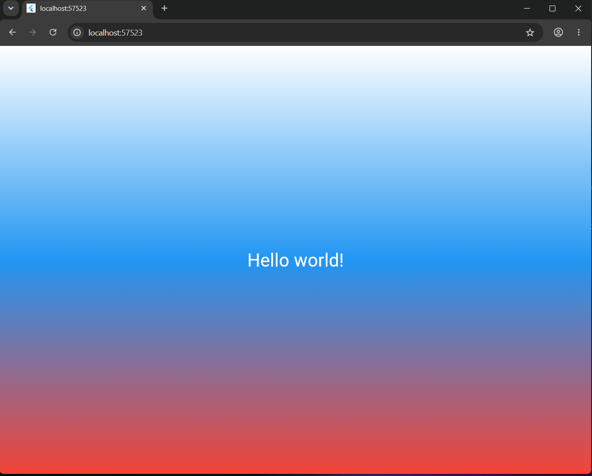

Flutter_Lab3 — Лабораторная работа №3
1. Учебный проект по изучению кроссплатформенной разработки на Flutter. Приложение запускается в браузере Chrome

2. Шевченко ИСП-242

3. пользовалась: Flutter 3.47.4; Dart 3.13.3; Платформа: Web (Chrome);IDE: VS Code

4. 

5. 1. Клонировать репозиторий `git clone — скачивает копию репозитория с GitHub на компьютер
    2. Перейти в папку проекта cd Flutter_Lab3
    3. Выполнить `flutter pub get`
    4. Запустить командой `flutter run -d chrome`

6.  1. Структура Flutter-проекта — назначение папок lib, web, test и файла pubspec.yaml.  

